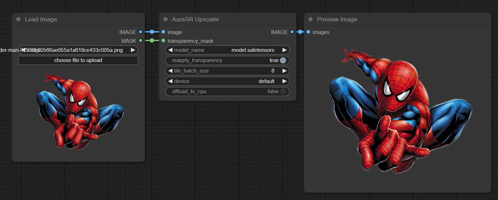
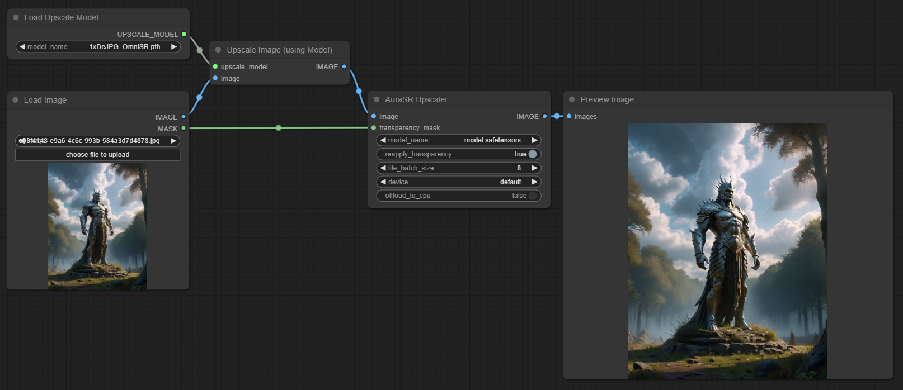

# AuraSR-ComfyUI
ComfyUI implementation of [Aura-SR](https://github.com/fal-ai/aura-sr)

ATTENTION:

The upscaler is ultra sensitive to ANY kind of image compression and when given such image the output will probably be terrible. It is highly recommended that you feed it images straight out of SD (prior to any saving) - unlike the example above - which shows some of the common artifacts introduced on compressed images.

TIP: If you are loading an already saved image (especially if its a .JPEG) - you can try to use a 'compression artifact-removal' model such as [DeJPG_OmniSR](https://openmodeldb.info/models/1x-DeJPG-OmniSR) before passing the image to AuraSR. Check these links to judge the results yourself: [imgsli](https://imgsli.com/Mjc1NzYw/0/2) and [imgur](https://imgur.com/a/pwFwnwF).

Example workflow with DeJPG:

# Update v2.1.0:
- Added support for AuraSR v0.4.0
	- Which introduces 2 new upscaling methods: '4x_overlapped_checkboard' and '4x_overlapped_constant'. [Comparison](https://imgsli.com/MjgxMzgx)
	- These new methods take at least twice the amount of time as the original but may offer better results.

# Instructions:
- Create a folder named 'Aura-SR' inside '\models'.
- Download the .safetensors AND config.json files from [HuggingFace](https://huggingface.co/fal/AuraSR/tree/main) and place them in '\models\Aura-SR'
- (Optional) Rename the model to whatever you want and rename the config file to the same name as the model (this allows for future, multiple models with their own unique configs).
- Using ComfyUI Manager install via Git URL, restart then reload the browser's page.
- Add Node > AuraSR > AuraSR Upscaler
- All of the node's parameters are self explanatory apart for 'transparency_mask' and 'reapply_transparency':
  - transparency_mask: (Optional) A mask obtained from loading a RGBA image (with transparent pixels). Can be directly connected to the 'Load Image' native node.
  - reapply_transparency: When given a valid mask AND/OR a RGBA image - it will attempt to reapply the transparency of the original image to the upscaled one. Keep in mind that the 'Load Image' native node auto-converts the input image to RGB (no transparency) before sending it to another node. Therefore if you are not passing a valid 'transparency_mask' then you need a specialized node capable of loading and outputing in RGBA mode.

TODO:
- Add support for multiple image inputs
